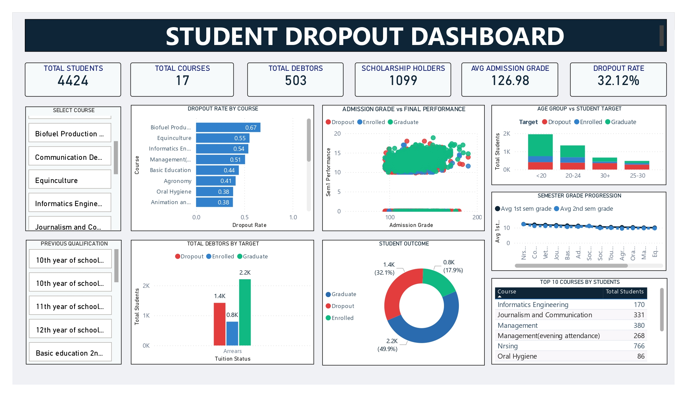

# 🎓 Student Dropout Prediction

An end-to-end data science project that analyses and predicts student dropout using the UCI *Predict Students' Dropout and Academic Success* dataset — covering data cleaning, SQL analysis, machine learning, a Streamlit prediction app and a Power BI dashboard.


---

## 📌 Problem Statement

Dropout is treated as an academic **early-warning problem**. Using records of **4,424 students**, the goal is to identify students at risk of dropping out early enough for advising or financial-aid support to make a difference.

The original target has three classes (Dropout, Enrolled, Graduate). For modelling, **Enrolled students were removed**, so the final models predict **Dropout vs Graduate**.

## 📂 Dataset

- **Source:** [UCI Machine Learning Repository – Predict Students' Dropout and Academic Success](https://archive.ics.uci.edu/dataset/697/predict+students+dropout+and+academic+success)
- **Size:** 4,424 students, 36 input features + 1 target
- **Missing values:** none
- **Feature groups:** demographics, socioeconomic background, admission details, semester-by-semester academic performance
- **Target distribution:** ~49.9% Graduate · ~32.1% Dropout · ~17.9% Enrolled

## 🛠️ Tools & Technologies

| Purpose | Tool |
|---|---|
| Data cleaning, EDA, ML | Python (pandas, NumPy, scikit-learn, XGBoost, matplotlib, seaborn) |
| Model development | Google Colab, VS Code |
| Storage & analysis queries | SQL Server Management Studio |
| Deployment | Streamlit |
| Dashboard | Power BI Desktop |
| Version control | Git & GitHub |

## 🧹 Data Cleaning & Transformations

- Standardised spacing and casing of all 36 column names so they work safely in pandas, SQL and Power BI
- Confirmed there are no missing values
- Decoded integer-coded columns (Application mode, Course, Nationality, Marital status, parents' qualification and occupation) into readable labels using the UCI data dictionary
- Exported the cleaned data as a single CSV

## 🔍 SQL Analysis & Business Queries

20 business questions were answered with SQL (see `analysis/student_dropout_analysis.sql`), for example:

- Relationship between marital status, parents' occupation, previous qualification and dropout
- Dropout rate by course and by application mode
- Average 1st/2nd semester grades for Dropout vs Enrolled vs Graduate
- Impact of scholarship status on dropout
- Dropout rate by age-at-enrollment bucket, and by gender × tuition-fee status
- Top 5 courses by dropout rate

## 🤖 Model Building

**Pipeline:** label-encode categorical columns → 80/20 stratified train-test split (`random_state=42`) → `StandardScaler` → `GridSearchCV` with 5-fold `StratifiedKFold`, scored on F1.

Six classifiers were tuned, plus one ensemble:

| Model | Description |
|---|---|
| **Logistic Regression** | Simple, interpretable linear model estimating class probability from weighted features; strong baseline |
| **Support Vector Machine** | Finds the boundary that best separates the classes with maximum margin |
| **K-Nearest Neighbours** | Predicts by majority vote among the k most similar students; sensitive to scaling |
| **Gaussian Naive Bayes** | Probabilistic model assuming independent, normally distributed features; very fast |
| **Random Forest** | Ensemble of decision trees; handles non-linearity and provides feature importance |
| **XGBoost** | Gradient boosting where each tree corrects the previous ones; regularised and accurate on tabular data |
| **Voting Classifier** | Soft-voting ensemble combining several of the models above |

## 📈 Results

Evaluated on a held-out test set of 726 students.

| Model | Key results |
|---|---|
| 🥇 **Logistic Regression** (C = 0.1) | Accuracy **91.74%**, F1 **0.9342**, best Dropout recall (**85%**) |
| 🥈 **Random Forest** (400 trees, depth 20) | Accuracy 91.46%, F1 0.9330, ROC-AUC 0.9535, Dropout precision 0.96 |
| SVM | F1 0.9300 |
| XGBoost | F1 0.9262, best ROC-AUC (0.9566) |
| KNN / Naive Bayes | Clearly weaker — missed 35% / 30% of dropouts |

Logistic Regression is recommended as the main model, with Random Forest as a second opinion for borderline cases.

## 💡 Key Insights

- **Academic performance is the strongest warning sign.** Dropouts averaged 7.26 in the 1st semester and 5.90 in the 2nd; Graduates averaged 12.64 in the 1st semester.
- **Finances matter.** Non-scholarship students drop out at ~38.7%, roughly three times the rate of scholarship holders; 215 dropouts (~15%) were debtors.
- **Age adds risk.** Among non-scholarship students, dropout rises from ~28% (ages 18–23) to ~55–63% for older students.
- **Course makes a big difference.** Nursing has the lowest dropout (~15%); Equinculture (55%), Informatics Engineering (54%) and Management (50%) are among the highest.

## 📊 Dashboard (Power BI)

KPIs: total students (4,424), overall dropout rate (~32.1%), average admission grade, average age at enrollment.
Visuals: dropout rate by course, financial-status segments, semester performance trend, target-class distribution.



## 🚀 Deployment (Streamlit)

An interactive app takes student details as input and returns the predicted outcome with model confidence and Graduate/Dropout probabilities.

```bash
# install dependencies
pip install streamlit pandas numpy scikit-learn xgboost joblib

# run the app
streamlit run app.py
```

> The app loads `models/Voting Classifier.pkl`, `models/label_encoder.pkl` and `models/scaler.pkl`, so keep the folder structure below intact.

## 🗂️ Repository Structure

```
student_dropout_prediction/
├── analysis/
│   ├── data_analysis_report.docx
│   ├── ssd.pbix
│   └── student_dropout_analysis.sql
├── data/
│   └── student_dropout_data.csv
├── docs/
│   └── student_dropout_dashboard.png
├── models/
│   ├── Voting Classifier.pkl
│   ├── label_encoder.pkl
│   └── scaler.pkl
├── notebooks/
│   └── ModelBuilding.ipynb
├── app.py
└── .gitignore
```
